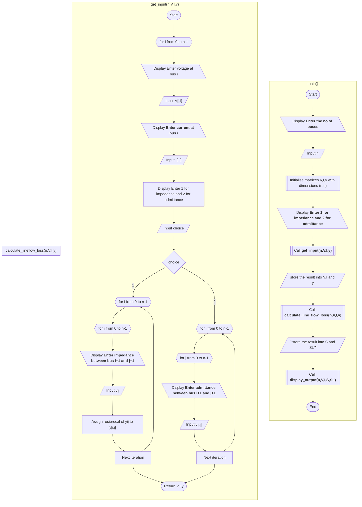

## View this project on github: [Github - Line flows and line losses](https://github.com/Sree2011/line-flows-and-losses/)

# Line Flows and Line Losses

Finding line flows and line losses in a power system.

## Formulas for Calculation

### Voltage Between Buses

- **Bus i and bus j**:
  $$
  V_{ij} = V_{i} - V_{j}
  $$

- **Bus j and bus i**:
  $$
  V_{ji} = V_{j} - V_{i}
  $$

### Current Calculation

- **Current from bus i to bus j**:
  $$
  I_{ij} = y_{ij}(V_i - V_j) + y_{i0} V_i
  $$

- **Current from bus j to bus i**:
  $$
  I_{ji} = y_{ji}(V_j - V_i) + y_{j0} V_i
  $$

### Line Flows

- **From bus i to bus j**:
  $$
  S_{ij} = V_{ij}I_{ij}^{*}
  $$

- **From bus j to bus i**:
  $$
  S_{ji} = V_{ji}I_{ji}^{*}
  $$

### Line Losses

  $$
  S_{L_{ij}} = S_{ij} + S_{ji}
  $$

## Algorithm

### **Main Program:**
**Input:**
- Number of buses, `n`
- User choice for impedance or admittance

**Process:**
- Initialize matrices `V`, `I`, and `y`
- Get input for voltage and current at each bus
- Depending on the user choice, input impedance or admittance values and update `y` matrix
- Calculate line flows and line losses

**Output:**
- Display line flows and line losses for each bus pair

### **Get Input from the User:**
**Input:**
- User choice (1 for impedance, 2 for admittance)
- Voltage at each bus, ` V[i, i] `
- Current at each bus, ` I[i, i] `
- Impedance or admittance values between buses

**Process:**
- For each bus, input voltage and current values
- If choice is impedance, input impedance values, calculate admittance, and update ` y ` matrix
- If choice is admittance, input admittance values and update ` y ` matrix

**Output:**
- Return matrices ` V `, ` I `, and ` y `

### **Calculate Line Flows and Line Losses:**
**Input:**
- Number of buses, ` n `
- Matrices ` V `, ` I `, and ` y `

**Process:**
- Initialize matrices ` S ` and ` SL `
- For each bus pair, calculate voltage differences
- For each bus pair, calculate current values using admittance and voltage differences
- For each bus pair, calculate line flows and line losses

**Output:**
- Return matrices ` S ` and ` SL `

### **Display the Line Flows and Line Losses:**
**Input:**
- Matrices ` V `, ` I `, ` S `, and ` SL `
- Number of buses, ` n `

**Process:**
- Create a list named `data`
- For each bus pair, add bus pair information, voltage, current, line flow, and line loss to `data`
- Declare headers and display them
- Display data for each bus pair

**Output:**
- Display line flows and line losses for each bus pair

## Pseudocode

<pre>
<h2><b>MAIN PROGRAM: </b></h2>
FUNCTION main()
    DISPLAY "Enter the number of buses"
    INPUT n
    INITIALISE matrices V, I, y with dimensions (n, n)
    DISPLAY "Enter 1 for impedance and 2 for admittance"
    INPUT choice
    V,I,y = get_input(n,V,I,y)
    S,SL = calculate_line_flow_loss(n,V,I,y)
    display_output(n,V,I,S,SL)
END FUNCTION
</pre>

<pre>
<h2><b>GET INPUT FROM THE USER: </b></h2>
FUNCTION get_input(n,V,I,y)
    FOR i from 0 to n-1:
      DISPLAY "enter the voltage at bus (i+1)"
      INPUT V[i, i]
      DISPLAY "enter the current at bus (i+1)"
      INPUT I[i, i]
    END FOR
    DISPLAY "Enter 1 for impedance and 2 for admittance"
    INPUT choice
    IF choice == 1
        FOR i from 0 to n-1:
            FOR j FROM 0 to n-1:
                DISPLAY "enter the impedance between bus (i+1) and (j+1)"
                INPUT yij
                y[i, j] = 1 / yij
            END FOR
        END FOR
    ELSE IF choice == 2:
        FOR i from 0 to n-1:
            FOR j FROM 0 to n-1:
            DISPLAY "enter the admittance between bus (i+1) and (j+1)"
            INPUT y[i, j]
            END FOR
        END FOR
    END IF

    RETURN V,I,y
END FUNCTION
</pre>

<pre>
<h2><b>CALCULATE LINE FLOWS AND LINE LOSSES: </b></h2>
FUNCTION calculate_line_flow_loss(n,V,I,y)
    INITIALISE MATRICES S,SL with dimensions (n,n)
    FOR i from 0 to n-1:
        FOR j FROM 0 to n-1:
            IF i is not equal to j:
                V[i, j] = V[i, i] - V[j, j]
                V[j, i] = V[j, j] - V[i, i]
            END IF
        END FOR
    END FOR

    FOR i from 0 to n-1:
        FOR j FROM 0 to n-1:
            IF i is not equal to j:
                I[i, j] = y[i, j] * (V[i, i] - V[j, j])
                I[j, i] = y[j, i] * (V[j, j] - V[i, i])
            END IF
        END FOR
    END FOR

    FOR i from 0 to n-1:
        FOR j FROM 0 to n-1:
            S[i, j] = V[i, j] * Conjugate(I[i, j])
            S[j, i] = V[j, i] * Conjugate(I[j, i])
            SL[i, j] = S[i, j] + S[j, i]
        END FOR
    END FOR
    RETURN S,SL
END FUNCTION
</pre>

<pre>
<h2><b>DISPLAY THE LINE FLOWS AND LINE LOSSES: </b></h2>
FUNCTION display_line_flows(V,I,S,SL,n)
    CREATE LIST data
    FOR i from 0 to n-1:
        FOR j FROM 0 to n-1:
            ADD "Bus Pair (i+1)-(j+1), Voltage V[i, j], Current I[i, j], Line Flow S[i, j], Line Loss SL[i, j]" TO data
    
    DECLARE headers = ["Bus Pair", "Voltage", "Current", "Line Flow", "Line Loss"]
    FOR i in headers
        DISPLAY i, end with space
    END FOR
    DISPLAY newline
    FOR i in data
        DISPLAY i
    END FOR

END FUNCTION
</pre>

## Flowchart

## Actual Code

Here are the links to actual code implementations:

1. [Python](./Line%20Flows%20and%20Losses/python/lineflow_loss.py)
2. [MATLAB](./Line%20Flows%20and%20Losses/MATLAB/lineflow_loss.m)
3. [Java](./Line%20Flows%20and%20Losses/java/lineflow_loss.java)

## References

1. Hadi Saadat, *Power System Analysis*, Mc-Graw Hill Education, 2010
